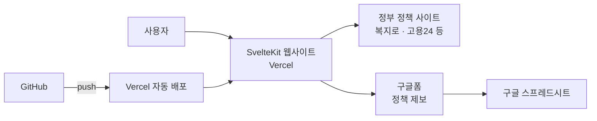

# 청년 지원 정책 모아보기

청년 지원 정책/사업 정보를 한곳에 모아 보여주는 웹사이트입니다.
일일이 찾아다녀야 하는 번거로움을 줄이고, 하나의 사이트에서 다양한 청년 지원 정책을 확인할 수 있습니다.

## 아키텍처



## 주요 기능

- **카테고리 분류** — 주거, 일자리, 교육, 복지, 창업 등 카테고리별 필터링
- **키워드 검색** — 정책명, 설명 등으로 빠르게 검색
- **외부 링크 연결** — 각 정책의 원본 페이지(복지로, 고용24 등)로 바로 이동
- **정책 제보** — 구글폼을 통해 누구나 새로운 정책 정보 제보 가능

## 기술 스택

| 구분 | 기술 |
|------|------|
| 프레임워크 | SvelteKit (Svelte 5) |
| 스타일링 | Tailwind CSS v4 |
| 언어 | TypeScript |
| 배포 | Vercel (adapter-auto) |
| 패키지 매니저 | bun |

## 로컬 실행

```bash
# 의존성 설치
bun install

# 개발 서버 실행
bun run dev

# 빌드
bun run build

# 빌드 미리보기
bun run preview
```
